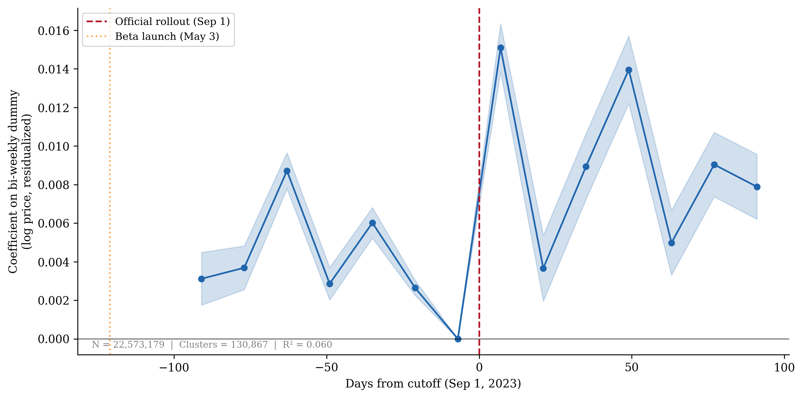
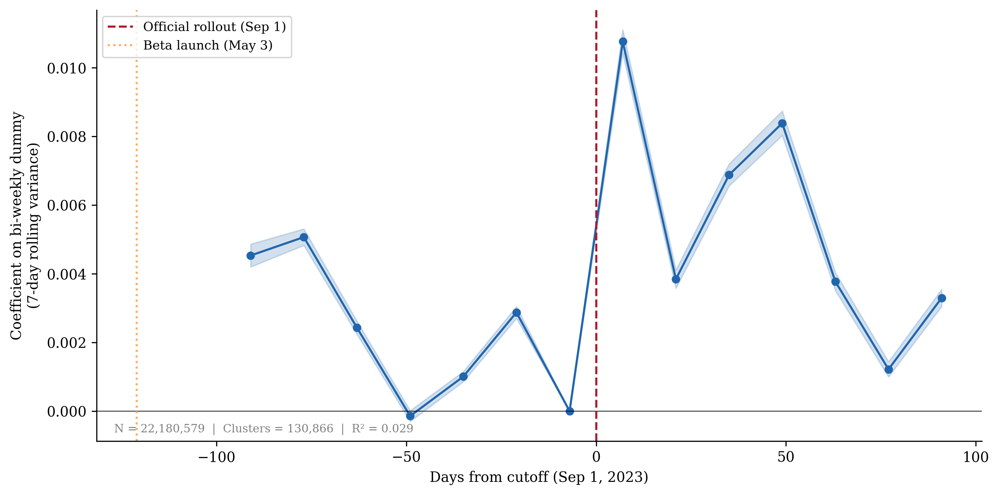
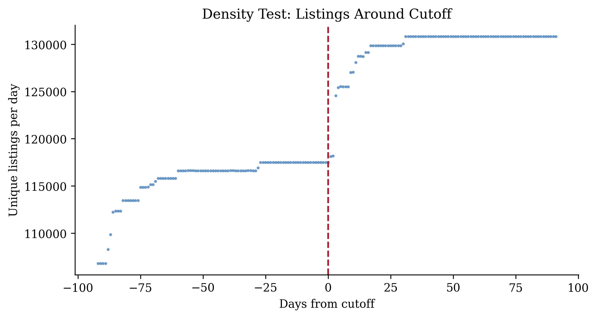
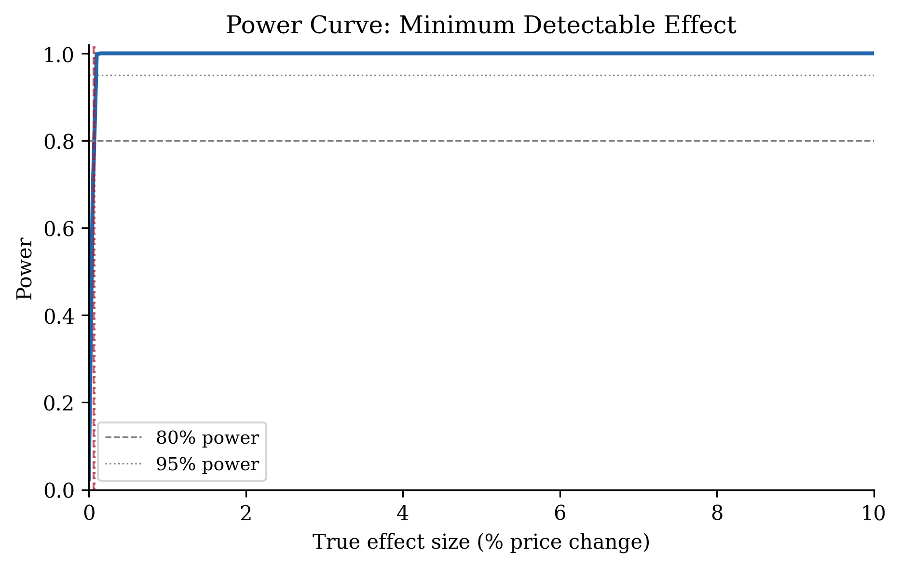

# Results

## Price Levels: Positive Point Estimates, Not Significant with Proper Inference

@tbl-itt-pooled reports pooled ITT estimates for log prices across bandwidths and specifications. On raw (non-residualized) prices ($Y_{ict}$), estimates are sensitive to bandwidth: positive at ±30 days ($\hat{\tau} = 0.0150$), negative at ±45 days ($-0.0041$), and increasingly negative at wider bandwidths ($-0.0108$ at ±60 days; $-0.0116$ at ±90 days). The sign reversal confirms the seasonal confounding concern raised by @hausman2018regression --- wider bandwidths incorporate more seasonal variation, which dominates the treatment effect.

After residualization, point estimates are positive at all bandwidths but decline monotonically: 1.93 percent at ±30 days (N = 7,473,139), 0.95 percent at ±45 days (N = 11,184,927), 0.67 percent at ±60 days (N = 14,896,717), and 0.51 percent at ±90 days (N = 22,228,725). With listing-level clustered standard errors, all estimates appear highly significant ($p < 0.001$). However, the relevant unit of independent variation is the *city*, not the listing: all listings within a city share the same cutoff date and the same local market conditions. With only 8 city-level clusters, standard cluster-robust SEs at the listing level severely overstate precision. @tbl-bootstrap reports a wild cluster bootstrap at the city level with 999 Rademacher-weighted iterations (Cameron, Gelbach, and Miller 2008). The bootstrap p-values range from 0.15 to 0.20 across all bandwidths --- **none of the estimates are statistically significant at conventional levels** when inference accounts for the small number of independent clusters.



: Wild cluster bootstrap results {#tbl-bootstrap}

The bootstrap result transforms the interpretation. The positive point estimates (0.5--1.9%) are consistent with a small genuine effect, but they are also consistent with zero. We cannot reject the null hypothesis that the algorithm had no effect on average price levels. This finding is robust: the balanced-panel specification and minimum-nights control (below) confirm that the point estimates are not artifacts of composition or bundled treatments, but the inference problem remains --- with 8 cities sharing a common cutoff, the design lacks the statistical power to detect effects of this magnitude with confidence.



: Pooled ITT RDD estimates {#tbl-itt-pooled}

**City-specific estimates.** @tbl-itt-city reports city-specific estimates at the ±60-day bandwidth on residualized outcomes. All eight cities show positive effects except Los Angeles, which is null ($+$0.06%, $p = 0.65$). The largest effects are in Chicago ($+$5.6%), Seattle ($+$2.9%), and Boston ($+$1.9%). Austin ($+$1.1%), New York City ($+$1.0%), San Francisco ($+$0.9%), and Washington, DC ($+$1.3%) show moderate positive effects.



: City-specific ITT RDD estimates {#tbl-itt-city}

**Bandwidth sensitivity.** The declining-with-bandwidth pattern is the key feature of the residualized estimates. At ±30 days, the effect is roughly four times larger than at ±90 days. This pattern could reflect a genuine local effect that attenuates as more distant observations enter the sample, or it could indicate that the residualization does not fully remove seasonal variation at narrow bandwidths. The raw (non-residualized) estimates, which show sign reversals across bandwidths, confirm that seasonality is a first-order concern in this RDiT design.

**Balanced-panel robustness.** @tbl-balanced restricts the sample to listings present on both sides of the cutoff within each bandwidth window. Approximately 90% of listings satisfy this criterion, indicating that the density jump at the cutoff reflects seasonal re-activation of existing listings rather than new entrants. The balanced-panel estimates are nearly identical to the full-panel estimates (±30d: 1.95% vs. 1.93%; ±90d: 0.43% vs. 0.51%), confirming that compositional changes do not drive the result.



: Balanced-panel ITT RDD estimates {#tbl-balanced}

**Minimum-nights control.** @tbl-controlled adds minimum-night requirements as a control variable in the RDD specification. The estimates are virtually unchanged (±30d: 1.91% vs. 1.93%; ±90d: 0.48% vs. 0.51%), indicating that the simultaneous minimum-nights policy change does not confound the price-level result.



: ITT RDD with minimum-nights control {#tbl-controlled}

## Price Variance: Suggestive but Not Robust

@tbl-variance-rdd reports OLS local-linear RDD estimates on within-listing temporal price variance at ±60 days. The coefficient for 7-day rolling variance of log prices is 0.0074 ($p < 0.001$); for 14-day rolling variance, 0.0094 ($p < 0.001$). Both estimates are positive and highly significant, suggesting that algorithm availability is associated with increased price dispersion.



: Variance RDD estimates (OLS, ±60d, listing-clustered SEs) {#tbl-variance-rdd}

**City-level descriptive evidence.** @tbl-variance-city reports pre- versus post-rollout within-listing variance by city. The increases are large in several markets: Austin (+99%), Boston (+92%), Washington, DC (+68%), and New York City (+45%). Chicago ($-$1.0%), Los Angeles ($-$2.5%), and Seattle (+2.8%) show minimal change.



: Within-listing variance pre vs. post by city {#tbl-variance-city}

**Robustness concern.** As documented in Section 4.5, the year-over-year DiD yields variance estimates of the *opposite sign* ($-$0.0008), indicating that the variance finding is sensitive to the identification strategy. We therefore characterize the RDD variance result as suggestive rather than definitive. The positive RDD estimate may reflect a genuine causal effect of algorithm availability, or it may capture a secular upward trend in pricing flexibility that the DiD absorbs but the cross-sectional RDD does not.

## Event Study

{#fig-event-price width=90%}

@fig-event-price plots the event-study coefficients from the bi-weekly specification on residualized log prices. Pre-period coefficients (up to 98 days before the cutoff) range from 0.0026 to 0.0087. These are statistically significant and, notably, several pre-period coefficients are larger than the treatment effect at wider bandwidths (0.51%). The nonzero pre-trends likely reflect residual seasonality not fully removed by the two-stage residualization, or listing composition changes over time. The post-period coefficients show a modest upward shift in the first two weeks ($\hat{\delta} = 0.0151$), followed by fluctuation between 0.0037 and 0.0140 with no clear trend.

The pre-trend pattern is a limitation of the RDiT design. While the magnitudes are economically small in absolute terms, their presence cautions against interpreting the post-period coefficients as cleanly identified treatment effects. The variance event study (@fig-event-variance) shows a more visible shift at the cutoff, though the same caveats apply.

{#fig-event-variance width=90%}

## Diagnostics

**Covariate balance.** @tbl-balance reports balance tests for predetermined listing characteristics at the cutoff. All eight covariates show statistically significant discontinuities ($p < 0.01$), including accommodates ($+$0.034), bedrooms ($+$0.013), number of reviews ($-$2.30), and host listing count ($-$0.18). The magnitudes are small relative to variable means (the accommodates discontinuity is less than 1% of the mean), but the universal significance is a concern. The balanced-panel specification (Section 4.1) addresses the compositional component; the covariate imbalance in the remaining sample reflects the extreme precision of 14.9 million observations rather than economically meaningful selection.



: Covariate balance at cutoff {#tbl-balance}

**Density test.** @fig-density displays the density of unique listings per day around the cutoff. The number of active listings jumps from approximately 117,000 per day before the cutoff to approximately 130,000 after --- an increase of roughly 11%. The balanced-panel analysis (Section 4.1) shows that 90% of post-cutoff listings also appear pre-cutoff, indicating the jump reflects seasonal re-activation rather than genuinely new entry. The balanced-panel estimates are nearly identical to the full-panel estimates, confirming that the density discontinuity does not drive the price results.

{#fig-density width=80%}

**Leave-one-city-out.** @tbl-loo reports pooled estimates dropping each city in turn. The estimates range from $-$0.0023 (dropping Los Angeles) to $+$0.0077 (dropping Austin). Most specifications yield positive coefficients between 0.0019 and 0.0024. Dropping Los Angeles or New York City --- the two largest markets --- flips the pooled sign to negative, indicating that the positive pooled estimate is sensitive to the inclusion of mid-sized cities with larger effects (Chicago, Seattle).



: Leave-one-city-out robustness {#tbl-loo}

## Year-over-Year DiD

@tbl-did-levels reports the year-over-year DiD comparing rollout-year prices to same-date prices in the prior year. The full-window estimate (weeks 38--52) is $-$0.0054 ($p < 0.001$), indicating that prices in the rollout year were 0.54% *lower* than same-date prices one year earlier, after absorbing listing and week-of-year fixed effects. Excluding December (weeks 38--48) strengthens the negative estimate to $-$1.6%.



: Year-over-year DiD: Log price {#tbl-did-levels}

The RDD and DiD give *opposite signs* for the price-level effect: the RDD finds positive effects (0.5--1.9%) while the DiD finds negative effects ($-$0.5% to $-$1.6%). The divergence likely reflects different confounders absorbed by each design. The RDD compares observations within a narrow window around the cutoff, netting out slow trends but retaining seasonality. The DiD differences out calendar-specific seasonality but absorbs any market-wide year-over-year trend (e.g., increased supply driving prices down between 2022 and 2023). Neither design dominates; the disagreement indicates that the true causal effect is bounded somewhere between the two estimates --- plausibly near zero.

**DiD on variance.** @tbl-did-variance reports the year-over-year DiD variance estimates: $-$0.0008 for 7-day variance and $-$0.0008 for 14-day variance, both statistically significant but economically small. The negative sign contrasts directly with the positive RDD estimate (+0.0074, +0.0094). The sign disagreement on both outcomes (levels and variance) underscores the identification challenge in this RDiT setting and motivates caution in interpreting any single specification as definitive.



: DiD variance estimates {#tbl-did-variance}

## Power Analysis

{#fig-mde width=80%}

@fig-mde displays the minimum detectable effect (MDE) at 80% power for the pooled RDD specification. The MDE is approximately 0.1 percent --- far below any economically meaningful threshold. The design is massively overpowered, which means that even the smallest residual confounding can produce statistically significant results. This cuts both ways: we can be confident that any large collusion effect would be detected, but we cannot interpret the statistical significance of the small positive estimates (0.5--1.9%) as evidence of a real treatment effect without resolving the seasonal confounding concern.

## DiD Robustness

**Leave-one-city-out (DiD).** Table 10 reports DiD estimates dropping each city. Coefficients range from $-$0.0033 (dropping Austin or Chicago) to $-$0.0078 (dropping Washington, DC), all negative and significant. The consistency across specifications increases confidence in the DiD pattern, though the interpretation remains subject to the annual-trend caveat.

**Placebo outcomes.** Table 11 reports DiD estimates on placebo outcomes. Minimum nights shows a large, significant discontinuity ($-$3.62, $p < 0.001$), indicating that platform-wide policy changes coincide with the rollout window. Availability shows a small positive discontinuity (+0.042). The minimum-nights result confirms that Airbnb bundled multiple platform changes in the September 2023 release. While controlling for minimum nights in the RDD does not change the price estimates (Section 4.1), the bundled treatment complicates causal attribution: we cannot cleanly separate the pricing-tool effect from the minimum-nights policy change.
